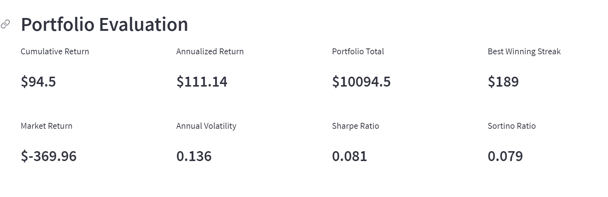
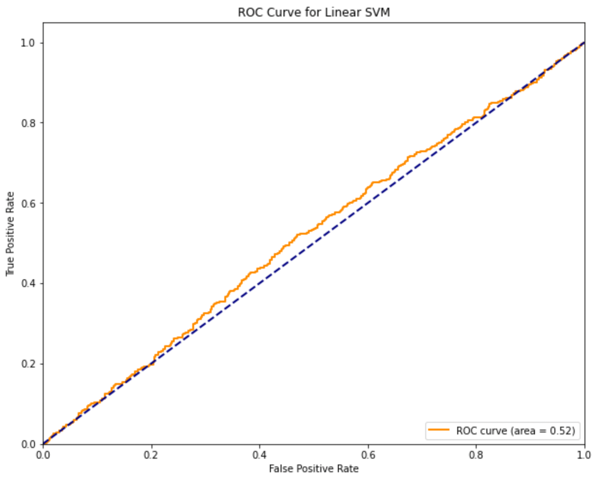

# Backtesting Lab

For this project, our team created a platform that allows users to generate stock trading algorithms with  Natural Language Processing (NLP), Machine Learning (ML), and technical indicators.

[Visit Backtesting Lab here](https://adamgulyas-project-2-app-d3jkvd.streamlitapp.com/)

## Usage

### Environment

Requires an [Anaconda](https://www.anaconda.com/products/distribution) virtual environment running Python >= 3.7.

Activate your Anaconda virtual environment.
```sh
conda activate <env>
```

### Dependencies

These installations are required to run the analysis. Newer package versions can be used, but be aware that library updates may cause code errors in the notebook.

```sh
pip install numpy
pip install pandas
pip install matplotlib
pip install plotly
pip install scikit-learn==1.0.2
pip install joblib
```

### Run

Run the `.ipynb` notebooks using the Jupyter Notebook editor of your choice.

## Description

* The Streamlit app generates buy/sell signals for the S&P 500, Nasdaq 100, and Russell 2000 indices by using either one or a combination of technical indicators, ML and NLP.

* Three time periods are available to backtest: the Dot-com Bubble, the 2008 Crash, and Covid. Each market episode includes a several-month lead up and trail off in order to capture the full picture of the time periods.

* Users can choose between using the Dual Moving Average Crossover (DMAC) indicator where they can choose the fast and slow moving averages, or a Linear Support Vector Machine (SVM) that has been trained on 4 and 100 day SMAs.

* Optionally, users can choose to combine the buy/sell signals with VADER sentiment scores derived from New York Times corpuses. Checking the ‘Add NY Times Sentiment Analysis’ box changes the algorithm to only enter long positions when the entry signal from either the DMAC or SVM is accompanied by a positive sentiment score.

## Output

There are three charts that display key information to the user.  Both DMAC and SVM charts are shown to give a comparative performance between the two methods.

  1. Actual (buy & hold) cumulative returns vs. algorithm cumulative returns
  2. Portfolio trade performance
  3. Entry/exit signals

### Portfolio Returns

The first chart compares the algorithm’s performance to the index’s performance. This chart will help users to determine whether their chosen strategy is adding value.  
---
Portfolio returns for S&P using DMAC during dot-com bubble


---
Portfolio returns for S&P using SVM during dot-com bubble


### Portfolio Performance

The chart below shows the buy/sell signals produced from the algorithm. From this chart, users can visually assess how well each signal contributed to the strategy's performance.
---
Portfolio performance for S&P using DMAC during dot-com bubble

---
Portfolio performance for S&P using SVM during dot-com bubble

---
### Trade entry/exit signals
The chart belows shows the entry/exit signals from both DMAC and SVM signals.  The chart helps users to assess the amount of trading turn-over from each strategy.
---
Entry/exit signals for S&P using DMAC during dot-com bubble

---
Entry/exit signals for S&P using SVM during dot-com bubble

---
The following table shows the relative performance between algorithms.

### DMAC
Performance during dot-com

Performance during Covid


### Linear SVM
Performance during dot-com

Performance during Covid


## With Sentiment Added

The following charts show the outperformance when NY Times sentiment signals are added. However, the outperformance isn't consistent throughout different testing periods. During the Covid period, sentiment signals did not improve the performance. This underperformance could be due to the introduction of NLP to the market in the recent past. As more market participants used NLP in their trading, the advantage of one participant over the other dissipated.

Portfolio Performance that includes sentiment signals. Performance for Dotcom period.

### DMAC with Sentiment



### SVM with Sentiment


### DMAC with Sentiment during Covid

.PNG)

### SVM with Sentiment during Covid


## Model Scoring

Albeit both models have a low Area Under the ROC Curve (ROC AUC), the linear model performed better. Increasing the model's AUC will be a central focus in the next version of the app.

### Linear SVM ROC Curve




### SVM ROC Curve


## Retrospective

* The DMAC algorithm beat the SVM algorithm. This outperformance is likely because the SVM was trained on 4 and 100 day SMAs, which do not explain much of the variance in the data. To rectify this, many technical indicators could be generated and run through feature importance to determine which indicators best explain the data.

* Using an SVM with fixed parameters may not be optimal as each data set may need different parameters. More research is needed to determine the optimal parameters to train the model on.

* Although trading returns improved when users included sentiment scores, more testing needed to prove the efficacy of this model. We would also like to explore rolling sentiment scores as opposed to daily scores currently in use.


## Streamlit app

[Take Backtesting Lab for a spin](https://adamgulyas-project-2-app-d3jkvd.streamlitapp.com/)


